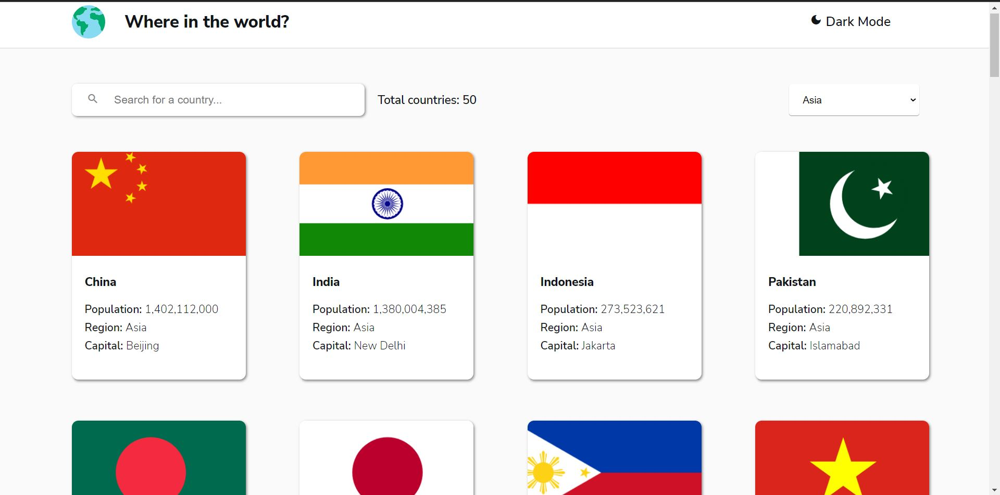
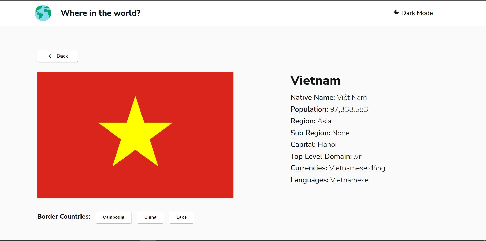

# REST Countries API with color theme switcher

Ý tưởng của project là từ một coding challenge trên trang [Frontend Mentor](https://www.frontendmentor.io/), trang web cung cấp các coding challenge để luyện tập kĩ năng cho các coder.

## Preview

### General view

### Detailed view

## Cấu trúc

Code viết theo mô hình MVC (Model-View-Controller) với model là module xử lí và lưu trữ các dữ liệu kéo về từ API [REST Countries](https://restcountries.com/), view gồm hai view chính chuyển đổi qua lại là view thông tin tổng quát cho nhiều đất nước và view thông tin chi tiết cho một đất nước cụ thể. Controller là module sẽ điều khiển hoạt động của web như một leader giao task cho model và view xử lí.
